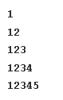
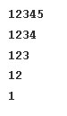
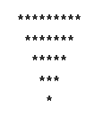
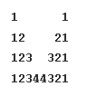

# 📚 Documentation

---

Welcome to `basic_patterns` folder, this folder contains the **pattern problems** and it's concepts.

---

## 📂 Folder Structure

The Folder right now is organized in following way:

* **`build/`** - It contains all the temprory binary output files & the images illustations of patterns.

* **`pattern_x.cpp`** - These are the main source files, where the code for specific pattern is stored, according to numbering.

---

## 💡 Important Pattern Problems

### Pattern 1 ✅

### Pattern 2 ✅

### Pattern 3 ✅

### Pattern 4 ✅

### Pattern 5 ✅
 

### Pattern 6 ✅

### Pattern 7 ✅

### Pattern 8 ✅

### Pattern 9 ✅

### Pattern 10 ✅

### Pattern 11 ✅

### Pattern 12 ✅

---

*Hope you have a nice day ahead ✨*

-- `RenSyntax`
